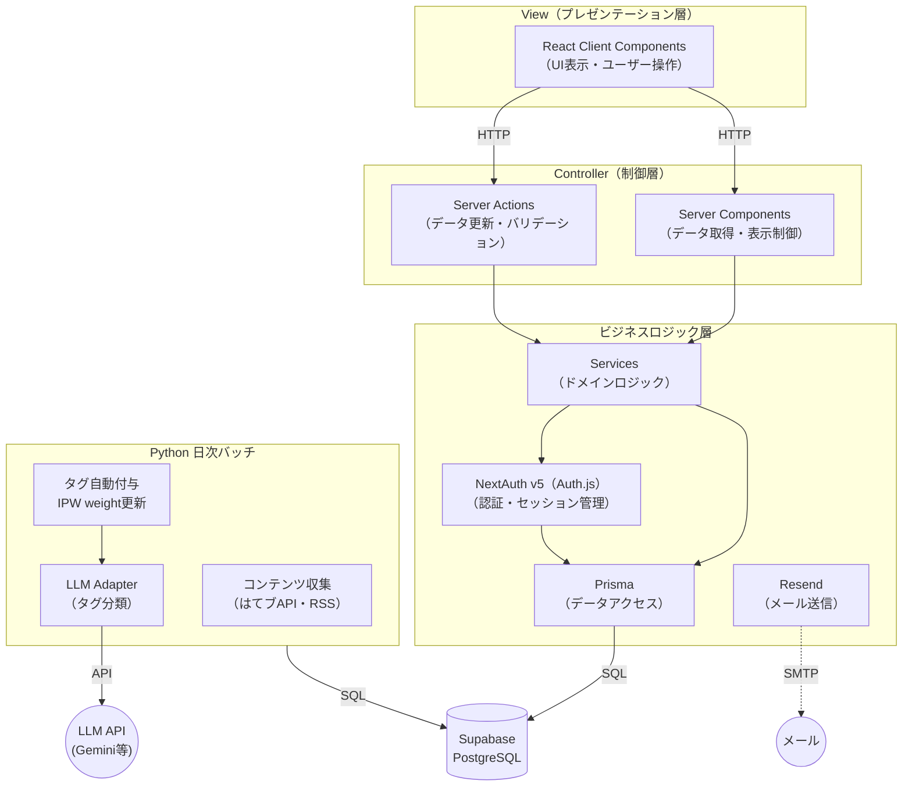

# アーキテクチャ仕様書

## 概要

エコーチェンバー脱却型コンテンツキュレーションアプリ「闇鍋」のシステム構成。

## システム構成



※ API Routesは使用しない（外部公開APIなし）
※ React Native (Expo) は将来対応。MVP時点ではWeb版のみ

## monorepo構成

```
yaminabe/
├── apps/
│   ├── web/                 ← Next.js (Web版)
│   └── mobile/              ← React Native / Expo（将来対応）
├── batch/                   ← Python 日次バッチ
├── packages/
│   ├── db/                  ← Prisma（スキーマ管理・マイグレーション）
│   └── shared/              ← 共有ロジック（型定義・ユーティリティ）
├── docker-compose.yml       ← 開発用PostgreSQLコンテナ
├── turbo.json
└── package.json
```

※ MVP時点ではWeb版のみ。mobile/は将来対応

## 技術スタック

| レイヤー | 技術 | バージョン |
|---------|------|-----------|
| Web フロントエンド | Next.js (React) | 16.2 (React 19) |
| モバイル フロントエンド | React Native (Expo)（将来対応） | — |
| サーバーサイド | Server Components / Server Actions | — |
| 日次バッチ | Python（収集・タグ付与・weight更新） | — |
| 認証 | NextAuth (Auth.js) + Credentials Provider | 5 |
| セッション管理 | DBセッション（sessionテーブル） | — |
| メール送信 | Resend（パスワードリセット） | 6.9 |
| データベース | Supabase PostgreSQL | — |
| ORM | Prisma | 6 |
| バリデーション | Zod | 4.3 |
| 状態管理 | useState / useContext / Zustand | 5.0 |
| CSS | Tailwind CSS | 4.2 |
| タグ自動付与（LLM） | Gemini 2.5 Flash-Lite（Google AI） | — |
| monorepo管理 | Turborepo | 2.8 |

## 認証方式

### 技術選定根拠

| 選定項目 | 採用 | 理由 |
|---------|------|------|
| 認証方式 | Email + Password（カスタム実装） | MVP最小構成。NextAuth v5はCredentials+DBセッション非対応のため自前実装。スキーマはNextAuth互換 |
| セッション管理 | DBセッション（sessionテーブル） | サーバー側でセッション無効化が可能。JWTではrevoke不可 |
| セッションID保持 | Cookie（セッショントークンのみ） | `crypto.randomUUID()`で生成。HttpOnly/Secure/SameSite=Lax |
| ルート保護 | proxy.ts（Next.js 16 proxy convention） | Cookie有無でリダイレクト制御。middleware.tsはNext.js 16で非推奨 |
| メール送信 | Resend | パスワードリセット専用。低コスト・API簡潔。開発環境はコンソールログ |

### 暗号・ハッシュ方式

| 用途 | 分類 | 方式 | 備考 |
|------|------|------|------|
| パスワード保存 | ハッシュ | bcrypt（ソルト + ストレッチング10ラウンド） | SHA-256は高速すぎてブルートフォースに弱いため不採用 |
| HTTPS通信 | 暗号化 | TLS 1.3（AES-256-GCM） | Vercel / Supabase が自動適用。アプリ層で直接扱わない |
| セッションID生成 | 乱数生成 | crypto.randomUUID()（UUIDv4, 122bit） | sessionテーブルに保存、Cookieで保持 |
| パスワードリセットトークン | 乱数生成 | crypto.randomBytes(32) | 有効期限10分。verification_tokenテーブル管理 |

## タグ自動付与方式

### 技術選定根拠

| 選定項目 | 採用 | 理由 |
|---------|------|------|
| 方式 | LLM APIによるテキスト分類 | 機械学習の内部実装不要。未知ワードのタグ抽出が可能 |
| 初期実装 | Gemini 2.5 Flash-Lite | 低コスト（MVP規模なら無料枠内）。日本語対応。バッチAPI対応 |
| 切替候補 | Claude Haiku 4.5 / GPT-4o-mini | サービス停止時に環境変数のみで切替可能 |

### LLMアダプタパターン

特定のLLMサービスへの依存を回避するため、共通インターフェースでプロバイダ差異を吸収する。

```
タグ付与ロジック
    ↓
LLMAdapter（共通インターフェース）
    ├── GeminiAdapter（初期実装）
    ├── ClaudeAdapter（切替候補）
    └── OpenAIAdapter（切替候補）
```

- 環境変数 `LLM_PROVIDER` でアダプタを切替
- 入出力スキーマ（JSON構造化出力）は全アダプタ共通

### タグ体系

- 定義済みタグリストから優先的に選択させる
- 該当するタグがない場合、LLMが新規タグを提案
- 提案された新規タグは管理テーブルに蓄積し、定期的にタグリストへ昇格を検討

### コスト見込み

| 規模 | Gemini Flash-Lite | Claude Haiku 4.5 | GPT-4o-mini |
|------|-------------------|------------------|-------------|
| 100記事/日 | 無料枠内 | 約¥15/月 | 約¥3/月 |
| 500記事/日 | 約¥3/月 | 約¥75/月 | 約¥15/月 |

## 非機能要件

### セキュリティ

| 脅威 | 対策 | 実現方法 |
|------|------|---------|
| SQLインジェクション | パラメータバインド | Prisma ORM（生SQLを使用しない） |
| XSS | 自動エスケープ | React DOM自動エスケープ + CSPヘッダー |
| CSRF | トークン検証 | 全Server Actionsに対しDouble Submit Cookieパターンを適用 |
| セッションハイジャック | Secure Cookie + HttpOnly | NextAuth設定。本番環境はHTTPS必須 |
| パスワード漏洩 | ハッシュ保存 | bcrypt（平文保存しない） |
| 認可バイパス | データアクセス制御 | Prisma where句でユーザーIDフィルタリング必須 |

### パフォーマンス

| 指標 | 目標値 | 実現方針 |
|------|--------|---------|
| 初回ページ表示（LCP） | < 2秒 | SSR（Server Components） |
| ページ遷移 | < 500ms | Next.js App Router プリフェッチ |
| API応答 | < 300ms (p95) | DB接続プール（Prisma） |
| 日次バッチ | < 10分 | 並列取得 + バルクインサート |

### 可用性

MVP時点ではSLA目標値を設定しない。Vercel + Supabase のマネージドサービスに依存。

## インフラ構成

### ランタイム環境

| ランタイム | バージョン | 用途 |
|-----------|-----------|------|
| Node.js | 20 LTS | Next.js アプリケーション |
| Python | 3.12 | 日次バッチ |

### 環境一覧

| 環境 | Web | バッチ | DB | 備考 |
|------|-----|--------|-----|------|
| 開発 | localhost (next dev) | ローカル実行 | Docker PostgreSQL 16 (ローカル) | docker compose up -d で起動 |
| 本番 | Vercel | GitHub Actions (cron) | Supabase (prod project) | Edge Functions未使用 |

### 環境分離

```
開発環境: .env.local → Docker PostgreSQL (localhost:5432)
本番環境: Vercel Environment Variables → Supabase prod project
```

※ 環境変数管理・デプロイ手順の詳細は `.docs/deploy-strategy.md` を参照
