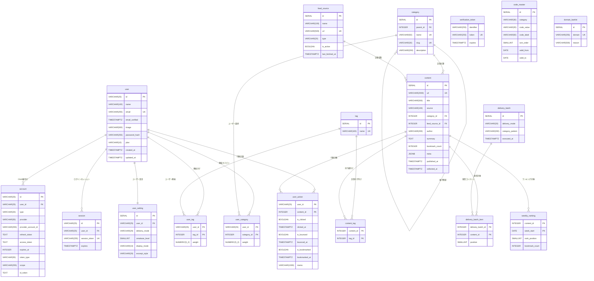

# ER図

## 凡例（Crow's Foot記法）

| 記号 | 意味 | 説明 |
|------|------|------|
| `──\|` | 1（必須） | 対応するレコードが必ず1つ存在する |
| `──\|\|` | 1のみ（必須） | 対応するレコードが必ず1つだけ存在する |
| `──○` | 0または1 | 対応するレコードが存在しない場合がある |
| `──<` (fork) | 多（1以上） | 対応するレコードが1つ以上存在する |
| `──○<` | 多（0以上） | 対応するレコードが0件の場合もある |

読み方の例:
- `user ||--o{ user_action` → userは必ず1つ存在し、user_actionは0件以上
- `user ||--|| user_setting` → 双方必ず1つずつ存在する

**共通カラム（アプリ独自テーブル全てに存在、ER図では省略）:** created_at, updated_at, updated_by, deleted_at

**色分け（SVG上）:** 認証関連テーブル = オレンジ系背景 / アプリ独自テーブル = 紫系背景

## Mermaid記法

