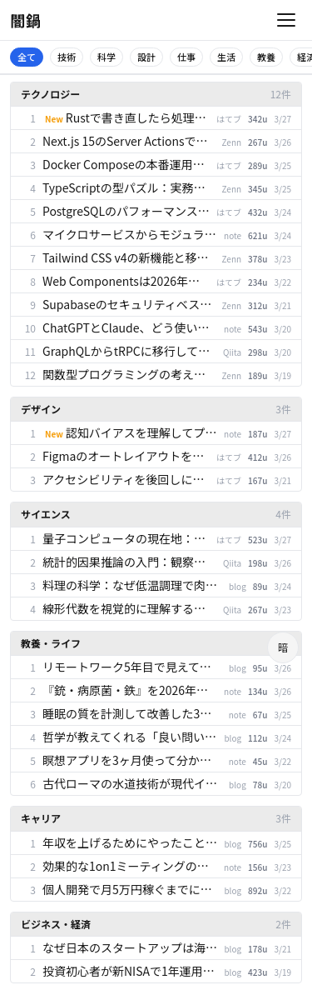
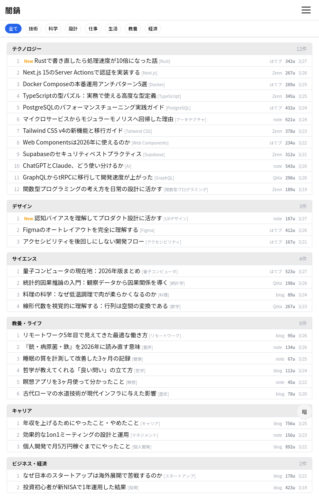
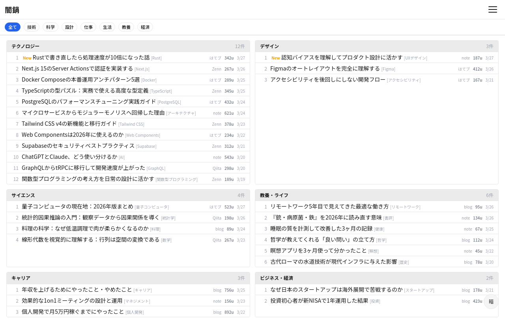
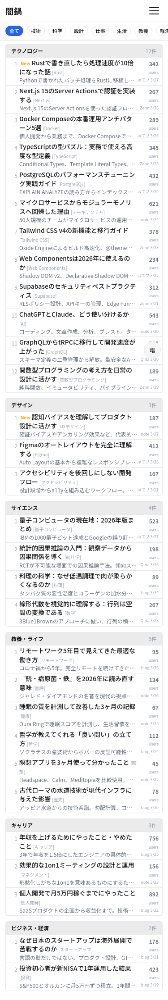
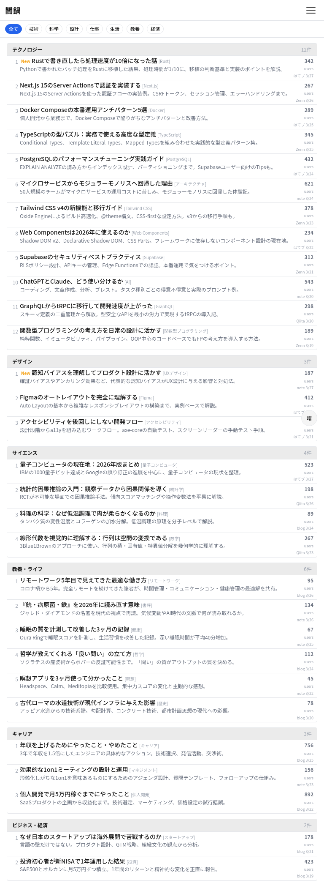
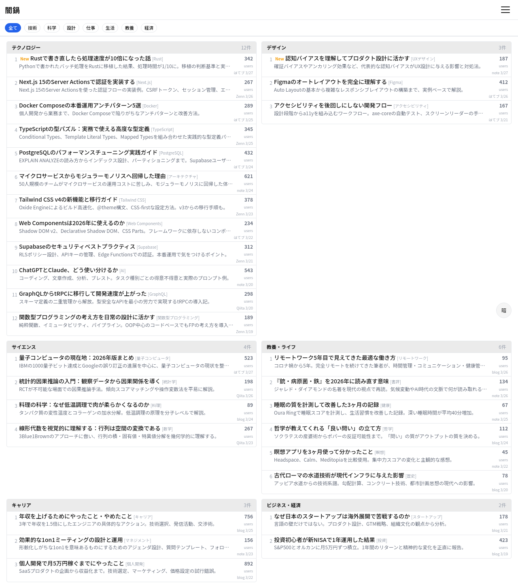

# S-01: フィード画面

## 概要

メイン画面。日次プールから取得したフィードを一覧表示し、ユーザーがコンテンツを発見・操作する。

- **アクセス**: ホーム（デフォルト画面）
- **認証**: 不要
- **プラン**: 全員

## レイアウト仕様

### モバイル (< 640px)
- 1カラム、カード/リスト縦積み
- 下部固定: 配信モード切替バー
- ヘッダー: ハンバーガーメニュー + ロゴ

### タブレット (640-1024px)
- 1〜2カラム（案による）
- サイドバー: 折りたたみ可能

### デスクトップ (> 1024px)
- メインカラム + サイドバー（カテゴリフィルタ等）
- 最大幅制限（1280px）

## 表示要素

| 要素 | 説明 |
|------|------|
| タイトル | 記事タイトル |
| ソース | 配信元（はてブ / note / ブログ名等） |
| カテゴリ | 記事のカテゴリ（階層表示） |
| サマリ | 記事の要約 |
| ブックマーク数 | はてブの場合 |
| 公開日 | 記事の公開日時 |
| Newバッジ | 初回登録記事に表示 |

## 状態一覧

| 状態 | 表示内容 |
|------|---------|
| ローディング | スピナー（Phase 4で実装） |
| 通常 | フィード一覧 |
| 空 | 「条件に合う記事がありません」+ 条件変更への導線 |
| エラー | インラインエラーメッセージ + リトライボタン |

## スクリーンショット

### feed-dense（高密度型）
| Mobile | Tablet | Desktop |
|--------|--------|---------|
|  |  |  |

### feed-hybrid（混合型）
| Mobile | Tablet | Desktop |
|--------|--------|---------|
|  |  |  |
