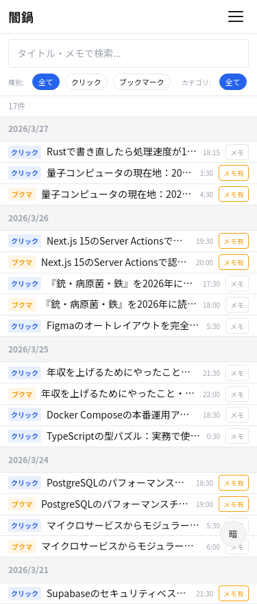
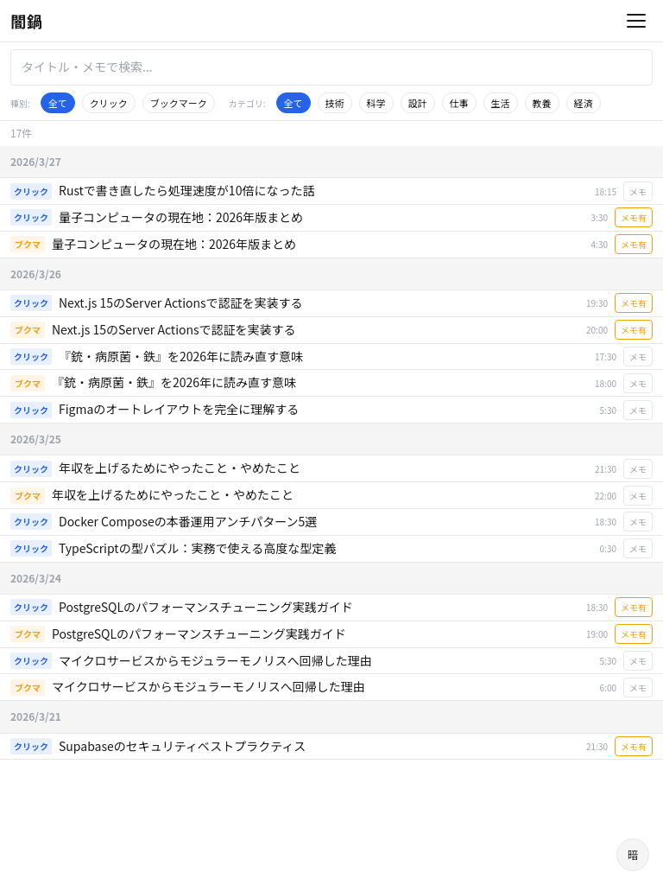
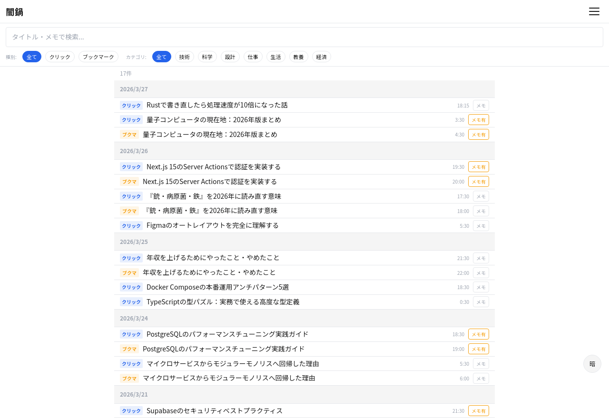

# S-02: ライブラリ画面

## 概要

行動履歴一覧。クリック・ブックマーク・メモ等のアクティビティを時系列で閲覧する。

- **アクセス**: ハンバーガーメニュー
- **認証**: 必須
- **プラン**: 有料

## レイアウト仕様

### モバイル (< 640px)
- 1カラム、リスト縦積み
- タブ切替: 全履歴 / ブックマーク / メモ付き
- ヘッダー: 戻るボタン + タイトル

### タブレット (640-1024px)
- 1カラム、リスト幅拡大
- タブ横並び

### デスクトップ (> 1024px)
- メインカラム + フィルタサイドバー
- 最大幅制限（1280px）

## 表示要素

| 要素 | 説明 |
|------|------|
| 記事タイトル | リンク付き |
| アクション種別 | クリック / ブックマーク / メモ |
| 日時 | アクション実行日時 |
| メモ内容 | メモ付きの場合、プレビュー表示 |

## 状態一覧

| 状態 | 表示内容 |
|------|---------|
| ローディング | スピナー（Phase 4で実装） |
| 通常 | 履歴リスト |
| 空 | 「まだ履歴がありません」+ フィード画面への導線 |
| エラー | インラインエラーメッセージ + リトライボタン |

## スクリーンショット

| Mobile | Tablet | Desktop |
|--------|--------|---------|
|  |  |  |
