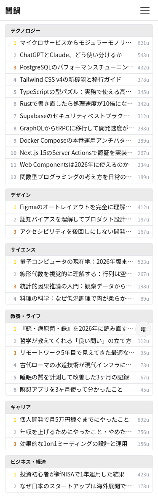
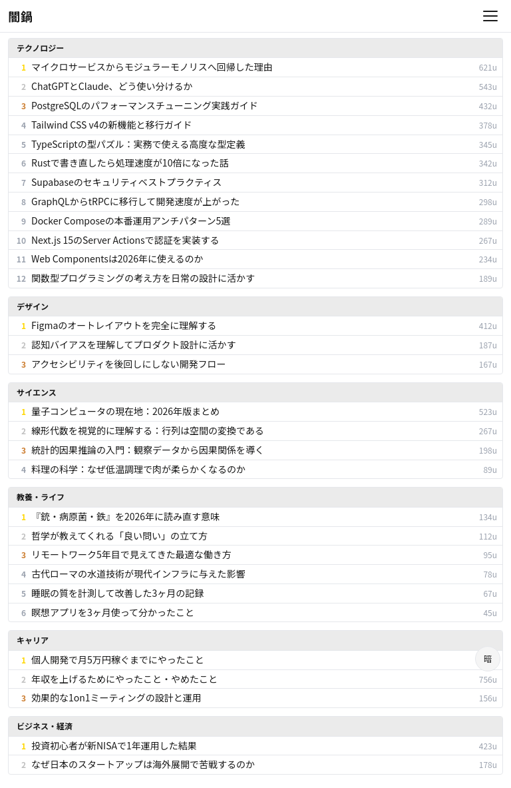
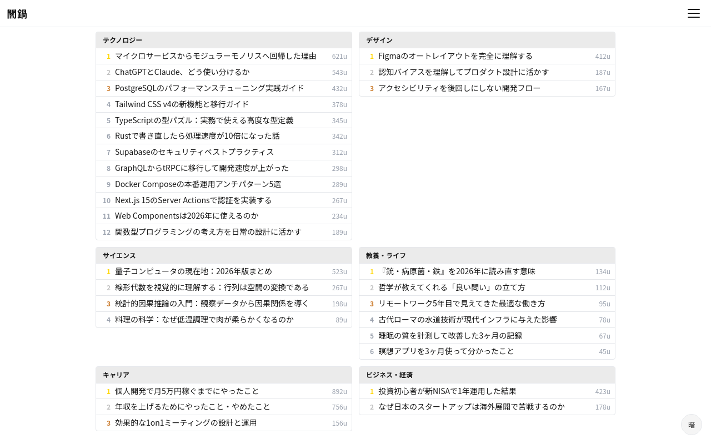

# S-03: 週次ランキング画面

## 概要

カテゴリ別の人気記事ランキングを閲覧する。

- **アクセス**: ハンバーガーメニュー
- **認証**: 必須
- **プラン**: 有料

## レイアウト仕様

### モバイル (< 640px)
- 1カラム、ランキングリスト縦積み
- カテゴリ切替: 横スクロールタブ
- ヘッダー: 戻るボタン + タイトル

### タブレット (640-1024px)
- 1カラム、リスト幅拡大
- カテゴリタブ横並び

### デスクトップ (> 1024px)
- メインカラム + カテゴリサイドバー
- 最大幅制限（1280px）

## 表示要素

| 要素 | 説明 |
|------|------|
| 順位 | 1位〜N位 |
| 記事タイトル | リンク付き |
| ソース | 配信元 |
| ブックマーク数 | スコア指標 |
| カテゴリ | 所属カテゴリ |

## 状態一覧

| 状態 | 表示内容 |
|------|---------|
| ローディング | スピナー（Phase 4で実装） |
| 通常 | ランキングリスト |
| 空 | 「今週のランキングはまだありません」 |
| エラー | インラインエラーメッセージ + リトライボタン |

## スクリーンショット

| Mobile | Tablet | Desktop |
|--------|--------|---------|
|  |  |  |
