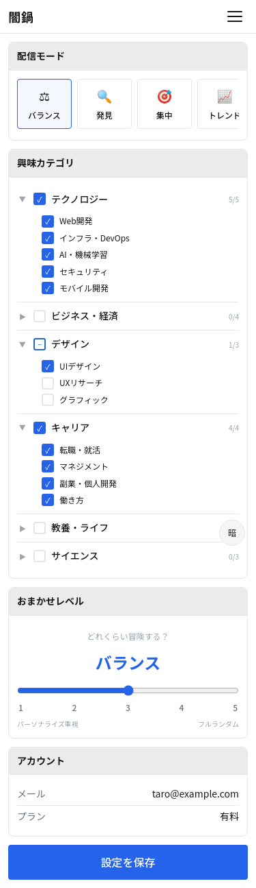
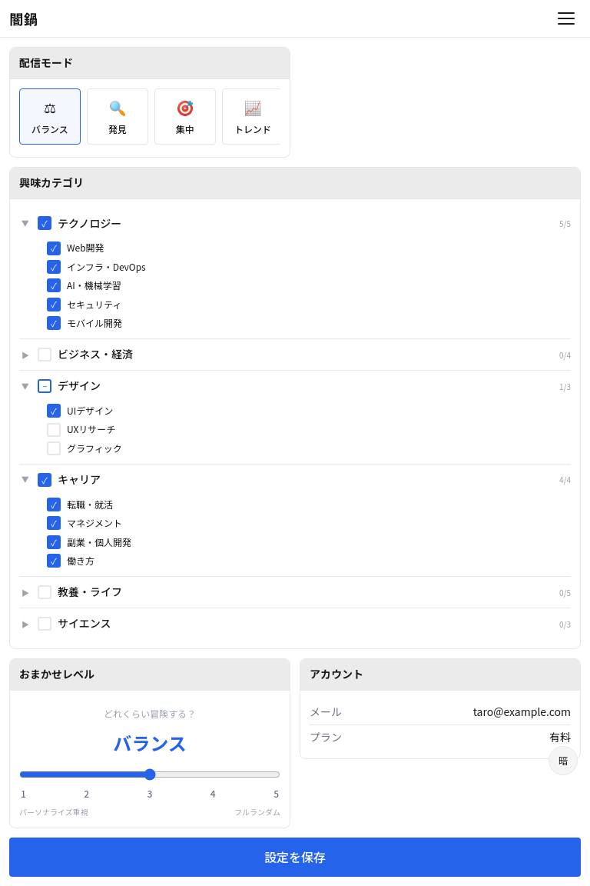
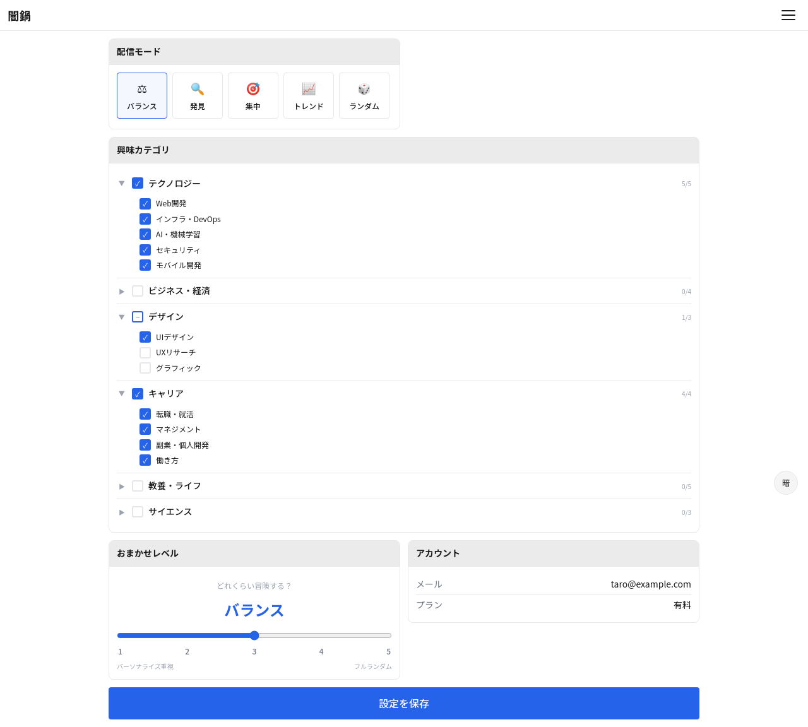

# S-04: ユーザー設定画面

## 概要

配信モード・カテゴリ等の設定変更を行う。

- **アクセス**: ハンバーガーメニュー
- **認証**: 不要
- **プラン**: 全員

## レイアウト仕様

### モバイル (< 640px)
- 1カラム、セクション縦積み
- ヘッダー: 戻るボタン + タイトル

### タブレット (640-1024px)
- 1カラム、セクション幅拡大

### デスクトップ (> 1024px)
- センターカラム（最大幅 640px）

## 表示要素

| 要素 | 説明 |
|------|------|
| 配信モード選択 | 5種の配信モードからラジオ選択 |
| カテゴリ設定 | 興味カテゴリの選択・編集（階層チェックボックス） |
| 温度スライダー | 0=完全パーソナライズ ↔ MAX=完全ランダム |
| アカウント情報 | 認証済み時: メールアドレス・プラン表示 |

## 状態一覧

| 状態 | 表示内容 |
|------|---------|
| ローディング | スピナー（Phase 4で実装） |
| 通常 | 設定フォーム |
| 保存中 | ボタン無効化 + スピナー |
| 保存完了 | トースト通知「設定を保存しました」 |
| エラー | インラインエラーメッセージ |

## スクリーンショット

| Mobile | Tablet | Desktop |
|--------|--------|---------|
|  |  |  |
