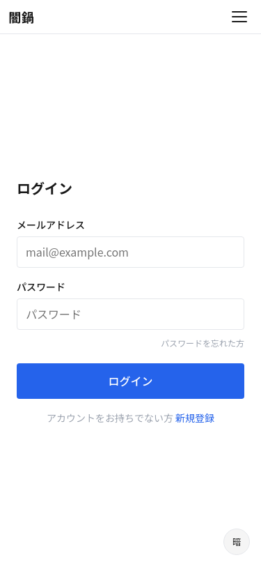
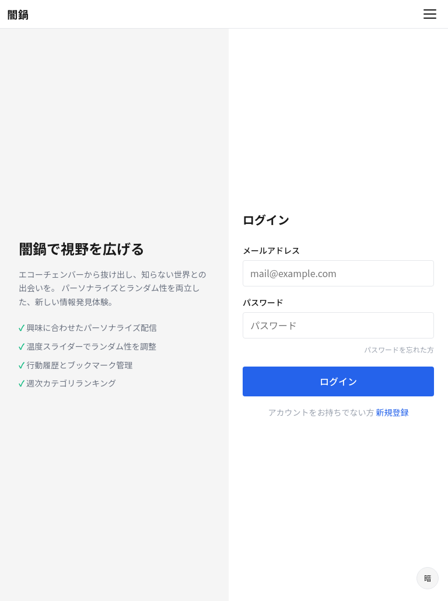
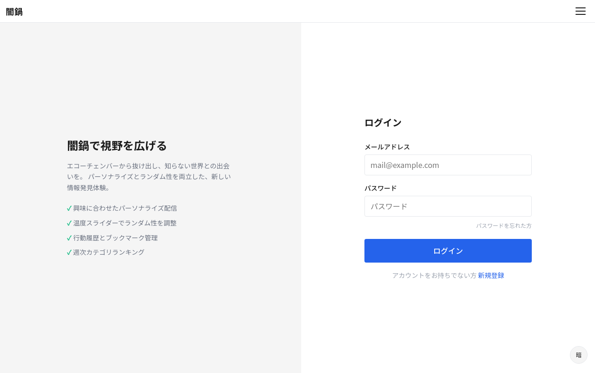

# S-05: 認証画面

## 概要

ログイン・サインアップ・パスワードリセット申請を1画面内のタブ切替で提供する。

- **アクセス**: ハンバーガーメニュー / 有料機能アクセス時
- **認証**: 不要
- **プラン**: 全員

## レイアウト仕様

### モバイル (< 640px)
- センターカラム、フォーム縦積み
- タブ切替: ログイン / 新規登録
- ヘッダー: 戻るボタン + タイトル

### タブレット (640-1024px)
- センターカラム（最大幅 480px）

### デスクトップ (> 1024px)
- センターカラム（最大幅 480px）
- 背景にブランドイメージ

## 表示要素

### ログインタブ
| 要素 | 説明 |
|------|------|
| メールアドレス | 入力フィールド |
| パスワード | 入力フィールド（表示切替付き） |
| ログインボタン | 送信 |
| パスワードを忘れた方 | リセット申請フォームへ切替 |

### 新規登録タブ
| 要素 | 説明 |
|------|------|
| メールアドレス | 入力フィールド |
| パスワード | 入力フィールド（強度インジケータ付き） |
| パスワード確認 | 入力フィールド |
| 登録ボタン | 送信 |

### パスワードリセット申請
| 要素 | 説明 |
|------|------|
| メールアドレス | 入力フィールド |
| 送信ボタン | リセットメール送信 |

## 状態一覧

| 状態 | 表示内容 |
|------|---------|
| 通常 | フォーム表示 |
| 送信中 | ボタン無効化 + スピナー |
| バリデーションエラー | フィールド下にエラーメッセージ |
| 認証エラー | フォーム上部にエラーバナー |
| リセットメール送信完了 | 「メールを送信しました」メッセージ |

## スクリーンショット

| Mobile | Tablet | Desktop |
|--------|--------|---------|
|  |  |  |
