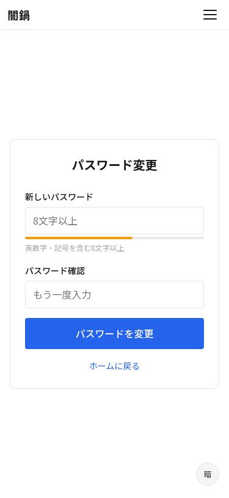
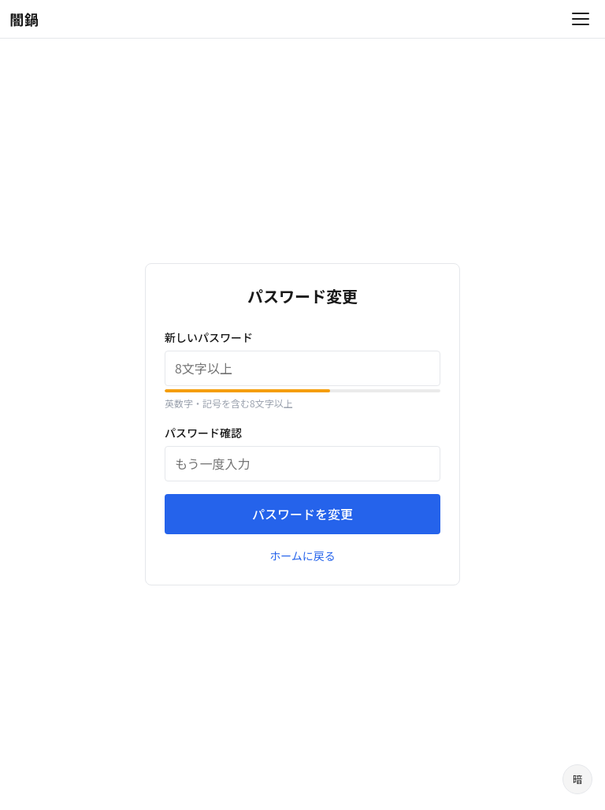
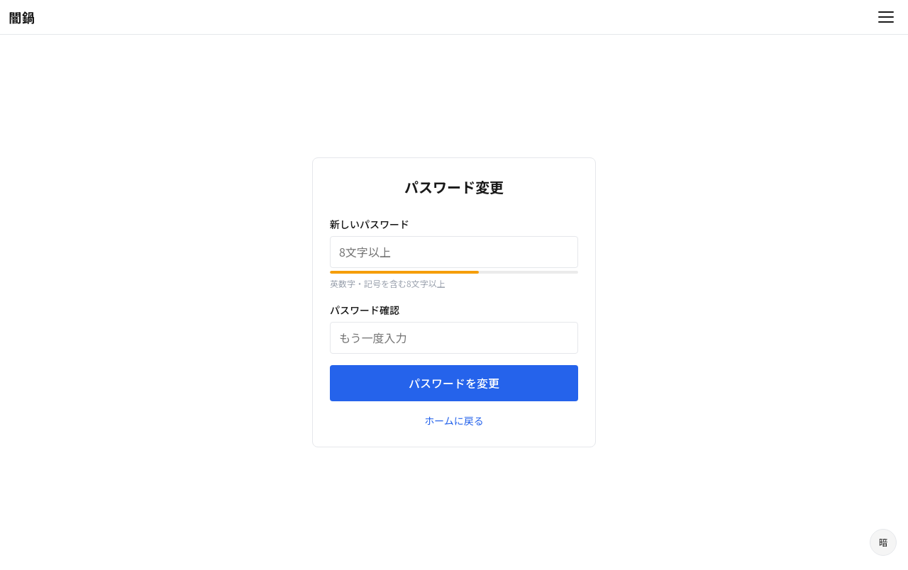

# S-06: パスワード変更画面

## 概要

メールリンク経由でアクセスし、トークン検証後にパスワードを再設定する。

- **アクセス**: メールリンク経由
- **認証**: 不要（トークンで認証）
- **プラン**: 有料

## レイアウト仕様

### 全ブレークポイント共通
- センターカラム（最大幅 480px）
- シンプルなフォーム1つ

## 表示要素

| 要素 | 説明 |
|------|------|
| 新しいパスワード | 入力フィールド（強度インジケータ付き） |
| パスワード確認 | 入力フィールド |
| 変更ボタン | 送信 |

## 状態一覧

| 状態 | 表示内容 |
|------|---------|
| 通常 | パスワード変更フォーム |
| トークン無効 | 「リンクが無効または期限切れです」+ 再申請への導線 |
| 送信中 | ボタン無効化 + スピナー |
| バリデーションエラー | フィールド下にエラーメッセージ |
| 変更完了 | 「パスワードを変更しました」+ ログイン画面への導線 |

## スクリーンショット

| Mobile | Tablet | Desktop |
|--------|--------|---------|
|  |  |  |
