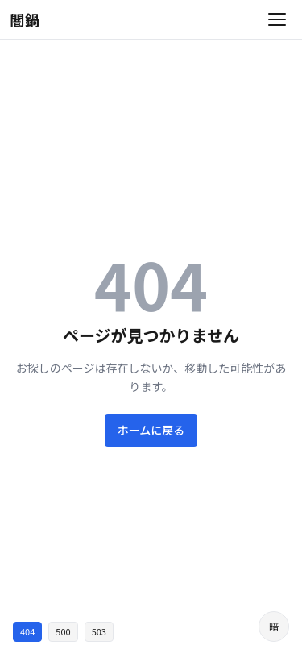
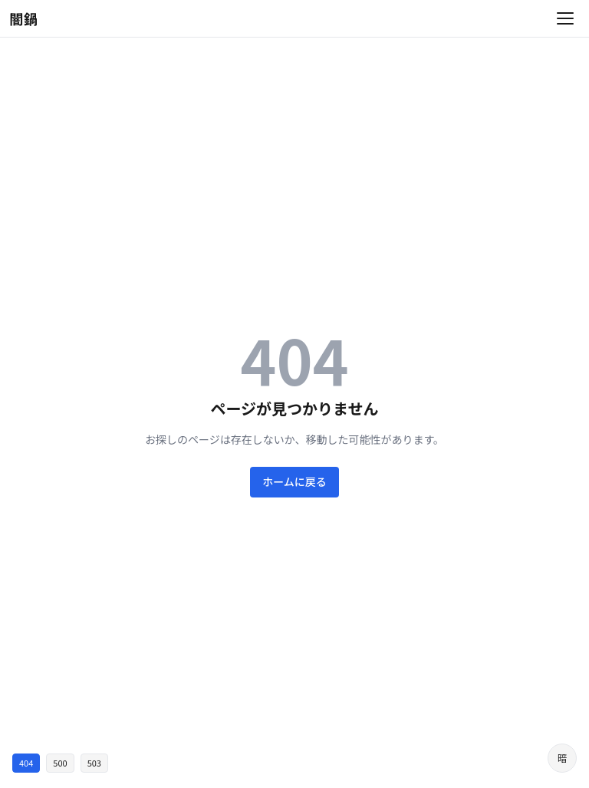
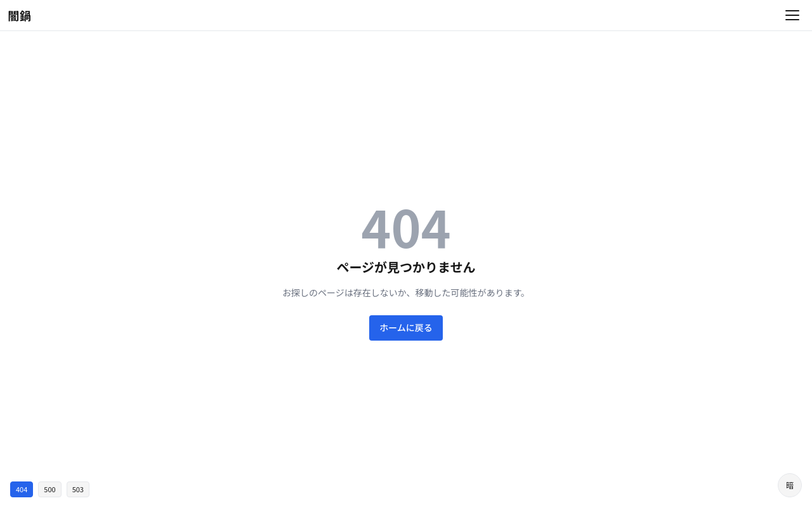

# S-07: エラー画面

## 概要

アプリケーションエラー発生時のフォールバック画面。

- **アクセス**: エラー発生時
- **認証**: —
- **プラン**: —

## レイアウト仕様

### 全ブレークポイント共通
- センターカラム
- エラーメッセージ + アクションボタン

## エラー種別

| コード | タイトル | メッセージ | アクション |
|--------|---------|-----------|-----------|
| 404 | ページが見つかりません | お探しのページは存在しないか、移動した可能性があります | ホームに戻る |
| 500 | サーバーエラー | 問題が発生しました。しばらくしてからお試しください | リトライ / ホームに戻る |
| 503 | メンテナンス中 | 現在メンテナンス中です | — |

## 状態一覧

| 状態 | 表示内容 |
|------|---------|
| 404 | イラスト + メッセージ + ホームリンク |
| 500 | イラスト + メッセージ + リトライボタン |
| 503 | メンテナンスメッセージ |

## スクリーンショット

| Mobile | Tablet | Desktop |
|--------|--------|---------|
|  |  |  |
