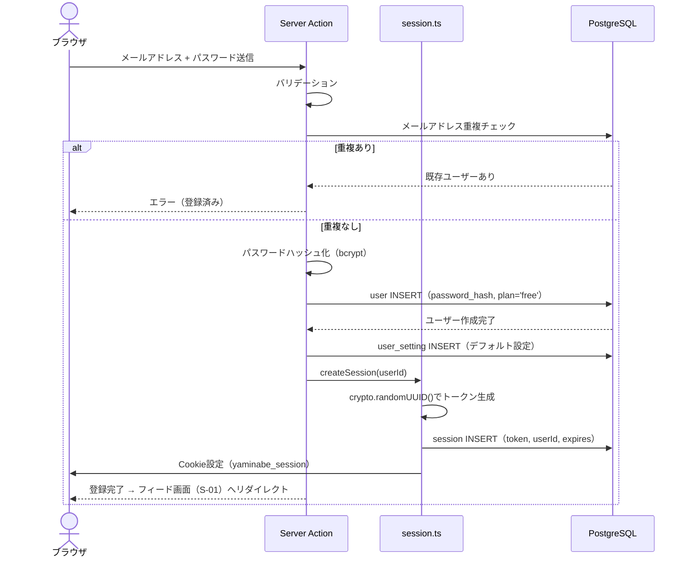
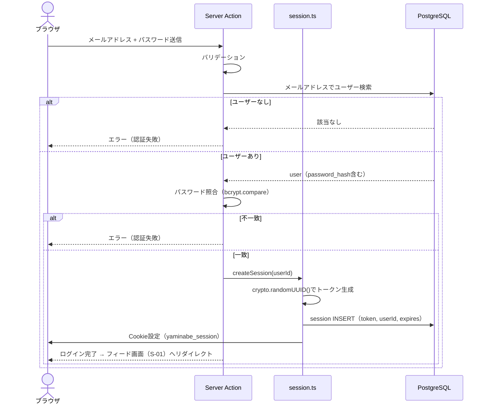
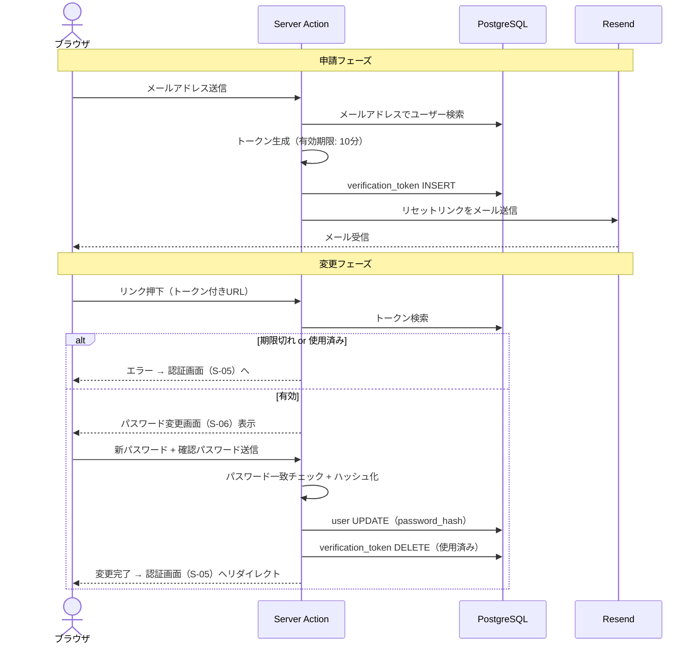
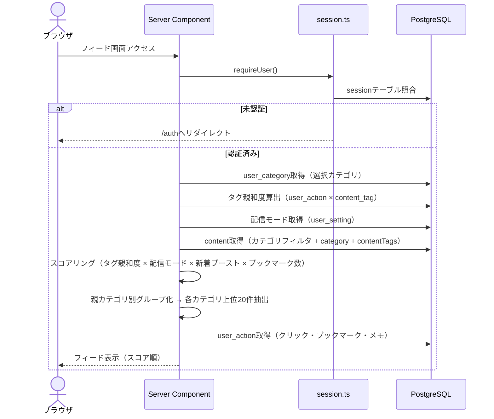
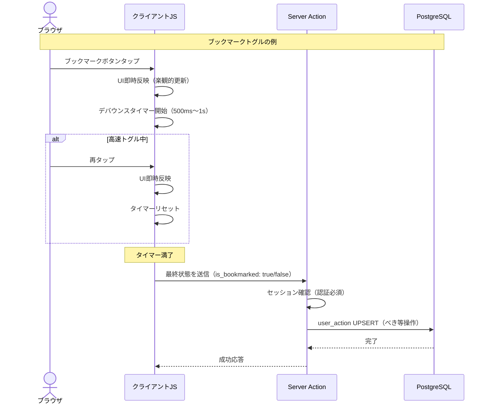
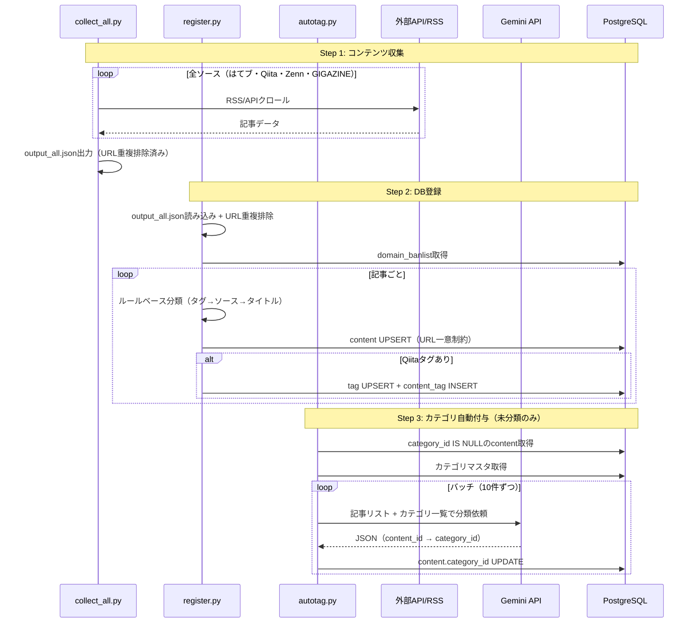

# シーケンス図

## 1. サインアップ

```mermaid
sequenceDiagram
    actor U as ブラウザ
    participant SA as Server Action
    participant SS as session.ts
    participant DB as PostgreSQL

    U->>SA: メールアドレス + パスワード送信
    SA->>SA: バリデーション
    SA->>DB: メールアドレス重複チェック
    alt 重複あり
        DB-->>SA: 既存ユーザーあり
        SA-->>U: エラー（登録済み）
    else 重複なし
        SA->>SA: パスワードハッシュ化（bcrypt）
        SA->>DB: user INSERT（password_hash, plan='free'）
        DB-->>SA: ユーザー作成完了
        SA->>DB: user_setting INSERT（デフォルト設定）
        SA->>SS: createSession(userId)
        SS->>SS: crypto.randomUUID()でトークン生成
        SS->>DB: session INSERT（token, userId, expires）
        SS->>U: Cookie設定（yaminabe_session）
        SA-->>U: 登録完了 → フィード画面（S-01）へリダイレクト
    end
```

## 2. ログイン

```mermaid
sequenceDiagram
    actor U as ブラウザ
    participant SA as Server Action
    participant SS as session.ts
    participant DB as PostgreSQL

    U->>SA: メールアドレス + パスワード送信
    SA->>SA: バリデーション
    SA->>DB: メールアドレスでユーザー検索
    alt ユーザーなし
        DB-->>SA: 該当なし
        SA-->>U: エラー（認証失敗）
    else ユーザーあり
        DB-->>SA: user（password_hash含む）
        SA->>SA: パスワード照合（bcrypt.compare）
        alt 不一致
            SA-->>U: エラー（認証失敗）
        else 一致
            SA->>SS: createSession(userId)
            SS->>SS: crypto.randomUUID()でトークン生成
            SS->>DB: session INSERT（token, userId, expires）
            SS->>U: Cookie設定（yaminabe_session）
            SA-->>U: ログイン完了 → フィード画面（S-01）へリダイレクト
        end
    end
```

## 3. パスワードリセット

```mermaid
sequenceDiagram
    actor U as ブラウザ
    participant SA as Server Action
    participant DB as PostgreSQL
    participant RS as Resend

    Note over U,RS: 申請フェーズ
    U->>SA: メールアドレス送信
    SA->>DB: メールアドレスでユーザー検索
    SA->>SA: トークン生成（有効期限: 10分）
    SA->>DB: verification_token INSERT
    SA->>RS: リセットリンクをメール送信
    RS-->>U: メール受信

    Note over U,RS: 変更フェーズ
    U->>SA: リンク押下（トークン付きURL）
    SA->>DB: トークン検索
    alt 期限切れ or 使用済み
        SA-->>U: エラー → 認証画面（S-05）へ
    else 有効
        SA-->>U: パスワード変更画面（S-06）表示
        U->>SA: 新パスワード + 確認パスワード送信
        SA->>SA: パスワード一致チェック + ハッシュ化
        SA->>DB: user UPDATE（password_hash）
        SA->>DB: verification_token DELETE（使用済み）
        SA-->>U: 変更完了 → 認証画面（S-05）へリダイレクト
    end
```

## 4. フィード取得

```mermaid
sequenceDiagram
    actor U as ブラウザ
    participant SC as Server Component
    participant SS as session.ts
    participant DB as PostgreSQL

    U->>SC: フィード画面アクセス
    SC->>SS: requireUser()
    SS->>DB: sessionテーブル照合
    alt 未認証
        SS-->>U: /authへリダイレクト
    else 認証済み
        SC->>DB: user_category取得（選択カテゴリ）
        SC->>DB: タグ親和度算出（user_action × content_tag）
        SC->>DB: 配信モード取得（user_setting）
        SC->>DB: content取得（カテゴリフィルタ + category + contentTags）
        SC->>SC: スコアリング（タグ親和度 × 配信モード × 新着ブースト × ブックマーク数）
        SC->>SC: 親カテゴリ別グループ化 → 各カテゴリ上位20件抽出
        SC->>DB: user_action取得（クリック・ブックマーク・メモ）
        SC-->>U: フィード表示（スコア順）
    end
```

## 5. ユーザーアクション（デバウンス方式）

```mermaid
sequenceDiagram
    actor U as ブラウザ
    participant CL as クライアントJS
    participant SA as Server Action
    participant DB as PostgreSQL

    Note over U,DB: ブックマークトグルの例
    U->>CL: ブックマークボタンタップ
    CL->>CL: UI即時反映（楽観的更新）
    CL->>CL: デバウンスタイマー開始（500ms〜1s）

    alt 高速トグル中
        U->>CL: 再タップ
        CL->>CL: UI即時反映
        CL->>CL: タイマーリセット
    end

    Note over CL: タイマー満了
    CL->>SA: 最終状態を送信（is_bookmarked: true/false）
    SA->>SA: セッション確認（認証必須）
    SA->>DB: user_action UPSERT（べき等操作）
    DB-->>SA: 完了
    SA-->>CL: 成功応答
```

## 6. 日次バッチ

```mermaid
sequenceDiagram
    participant CO as collect_all.py
    participant RG as register.py
    participant AT as autotag.py
    participant API as 外部API/RSS
    participant GM as Gemini API
    participant DB as PostgreSQL

    Note over CO,DB: Step 1: コンテンツ収集
    loop 全ソース（はてブ・Qiita・Zenn・GIGAZINE）
        CO->>API: RSS/APIクロール
        API-->>CO: 記事データ
    end
    CO->>CO: output_all.json出力（URL重複排除済み）

    Note over RG,DB: Step 2: DB登録
    RG->>RG: output_all.json読み込み + URL重複排除
    RG->>DB: domain_banlist取得
    loop 記事ごと
        RG->>RG: ルールベース分類（タグ→ソース→タイトル）
        RG->>DB: content UPSERT（URL一意制約）
        alt Qiitaタグあり
            RG->>DB: tag UPSERT + content_tag INSERT
        end
    end

    Note over AT,DB: Step 3: カテゴリ自動付与（未分類のみ）
    AT->>DB: category_id IS NULLのcontent取得
    AT->>DB: カテゴリマスタ取得
    loop バッチ（10件ずつ）
        AT->>GM: 記事リスト + カテゴリ一覧で分類依頼
        GM-->>AT: JSON（content_id → category_id）
        AT->>DB: content.category_id UPDATE
    end
```
